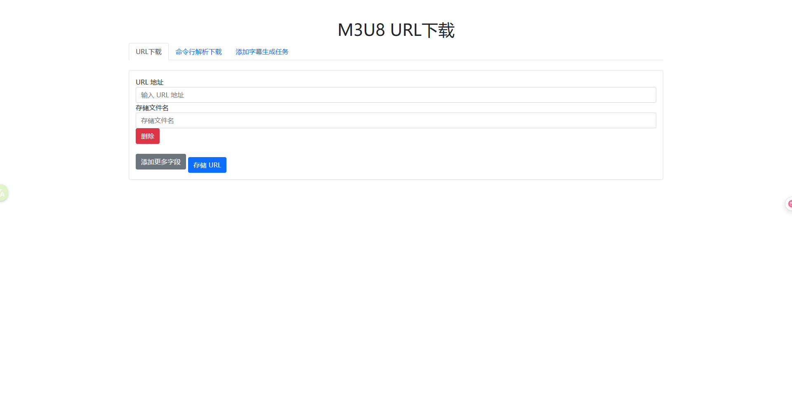

# m3u8dl_for_web 纯自用，从开始的m3u8下载，扩展到字幕生成和翻译
# 主要特性和功能
#### m3u8 下载
* 基于 orestonce/m3u8d 实现
* 使用ffmpeg进行切片合并

#### 字幕生成
* 集成多种供应商包括：
    - [x] whisper via groq
    - [x] whisper.cpp via golang
    - [x] whisper.cpp server
    - [x] sherpa via golang
* 字幕翻译
    - [x] deeplx
    - [x] openai compatible api
    - [x] baidu(not test)
* 采用ffmpeg切分音视频进行转录，解决长视频后半段识别不准确问题
* sqlite 做任务存储

#### 附带webui方便操作

# 前端
前端使用复古的`jquery` 和`bootstrap`,位于`resource/static/index.html`,单文件易于维护

# 配置
参考`resource/config.sample.yaml`

# 运行
* 依赖 golang:1.23.0,whisper.cpp
* `go mod download `
* `go build -o app ./cmd/`
* 默认不编译`whisper.cpp via golang`和`sherpa via golang`,使用`-tags localWhisper`可编译进去，使用这个tag需要启用CGO
* 具体动态依赖可参考`Dockerfile`

